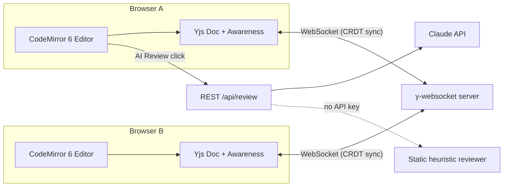

# CollabCode

A real-time collaborative code editor — think "Google Docs for code" — with live multi-cursor
editing, per-room presence, and an AI-powered code review assistant.

Built as a full-stack systems project: the interesting engineering problem here isn't CRUD,
it's **keeping multiple people's edits in sync in real time without conflicts**, which is
what most CRUD-style student projects never touch.

## Features

- **Real-time collaborative editing** — multiple people typing in the same file at once,
  changes merge automatically with no "last write wins" data loss, powered by a CRDT
  (Conflict-free Replicated Data Type) via [Yjs](https://github.com/yjs/yjs).
- **Live cursors & presence** — see who's online and where their cursor is, in their own color.
- **Room-based sessions** — join any room by name; everyone in that room shares one document.
- **Multi-language support** — JavaScript, Python, and C++ syntax highlighting.
- **AI code review** — one click sends the current code to Claude for a structured review
  (summary, flagged issues by severity, improvement suggestions). Falls back to a built-in
  static analyzer if no API key is configured, so the app always works.

## Why this project (for reviewers/recruiters)

Most student "chat app" or "todo app" clones don't require reasoning about concurrency.
This one does: it demonstrates

- Real-time systems design (WebSockets, CRDTs, eventual consistency)
- Full-stack ownership (React frontend, Node/Express backend, protocol design)
- Practical AI integration (an LLM used as a feature, not a chatbot wrapper)
- A UI actually designed with intent, not a default template

## Architecture



**How sync works:** every keystroke is applied to a local Yjs document, which encodes it as a
small CRDT update. That update is broadcast over a WebSocket to everyone else in the same room;
each client merges it into their own Yjs doc. CRDTs guarantee that no matter what order updates
arrive in, everyone converges to the same final document — no central "lock the file" step
needed. Cursor position and username/color are synced the same way via Yjs's awareness protocol.

## Tech stack

| Layer          | Tech                                                              |
|----------------|--------------------------------------------------------------------|
| Frontend       | React, Vite, CodeMirror 6, `y-codemirror.next`                    |
| Real-time sync | Yjs (CRDT), `y-websocket`, `ws`                                    |
| Backend        | Node.js, Express                                                   |
| AI review      | Claude API (`claude-sonnet-4-6`), with a rule-based fallback       |

## Project structure

```
CollabCode/
├── server/            Node/Express backend + Yjs WebSocket server
│   ├── server.js
│   ├── rooms.js
│   ├── aiReview.js
│   └── .env.example
└── client/             React frontend
    └── src/
        ├── App.jsx
        ├── components/
        │   ├── CodeEditor.jsx
        │   ├── UserList.jsx
        │   └── ReviewPanel.jsx
        └── styles.css
```

## Running it locally

You'll need Node.js 18+.

### 1. Backend

```bash
cd server
npm install
cp .env.example .env      # optionally add ANTHROPIC_API_KEY for real AI reviews
npm run dev
```

Server starts on `http://localhost:4000` (REST API + WebSocket on the same port).

### 2. Frontend

```bash
cd client
npm install
npm run dev
```

Opens on `http://localhost:5173`. Enter a room name and share it with a friend / open a
second browser tab to see live collaboration in action.

### Deploying

- Frontend: build with `npm run build` in `client/`, deploy the `dist/` folder to Vercel/Netlify.
- Backend: deploy `server/` to Render/Railway/Fly.io (needs a persistent WebSocket-capable host).
- Set `VITE_WS_URL` and `VITE_API_URL` in the client's environment to point at your deployed backend.

## Possible extensions (good "future work" talking points in an interview)

- Persist documents to Postgres so rooms survive server restarts
- Add authentication + private rooms
- In-browser code execution via a sandboxed runner (e.g. Judge0 API)
- Voice chat alongside the editor (WebRTC)
- Operational history / playback of how a file evolved

## Resume bullet points (edit to taste)

- Built a real-time collaborative code editor supporting concurrent multi-user editing using
  CRDTs (Yjs) over WebSockets, with live cursor presence and zero merge conflicts.
- Integrated the Claude API to provide automated, structured code review (issues + suggestions),
  with a rule-based fallback ensuring 100% feature uptime without external dependencies.
- Designed and implemented the full stack (React/Vite frontend, Node/Express backend, WebSocket
  protocol) from scratch, including a custom dark-mode IDE-style UI.
